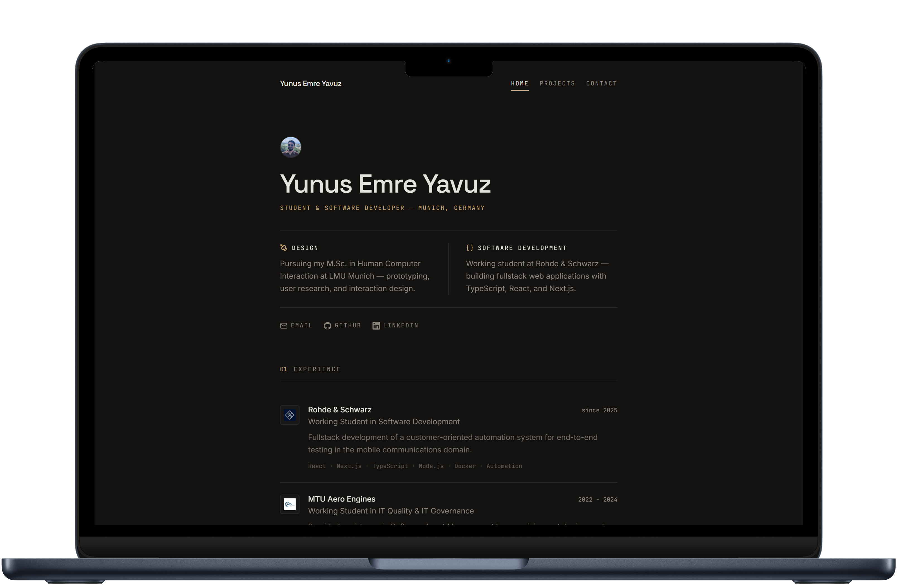

<div align="center">

</div>

# Portfolio

Personal portfolio and resume site — live at [yuemya.de](https://yuemya.de). Built with [Next.js](https://nextjs.org/) and self-hosted.

## Features

- **Resume-style home page** — experience, education, and skills rendered from a single config file, with a one-click CV download
- **On-demand LaTeX CV generation** — the [`/api/generate-cv`](app/api/generate-cv/route.ts) route compiles the LaTeX sources in `data/cv/` with [tectonic](https://tectonic-typesetting.github.io/).
- **Projects page** — searchable, filterable showcase split into *design* and *engineering* disciplines, plus a collection of lab notes/experiments
- **Project detail pages** — static generation with hero images and image galleries

## Tech Stack

- [Next.js](https://nextjs.org/) 16 + [React](https://react.dev/) 19 + [TypeScript](https://www.typescriptlang.org/) + [Tailwind CSS](https://tailwindcss.com/)
- [tectonic](https://tectonic-typesetting.github.io/) for LaTeX CV compilation
- [Docker](https://www.docker.com/) multi-stage build, deployed with [Coolify](https://coolify.io/)


## Getting Started Locally

1. Clone this repository:

   ```bash
   git clone https://github.com/yunuseyvz/portfolio
   cd portfolio
   ```

2. Install dependencies:

   ```bash
   npm install
   ```

3. Start the dev server:

   ```bash
   npm run dev
   ```

4. Open [data/resume.tsx](./data/resume.tsx) and make changes — the site is fully driven by the data files in [`data/`](./data/).

## License

Licensed under the [MIT license](./LICENSE).
